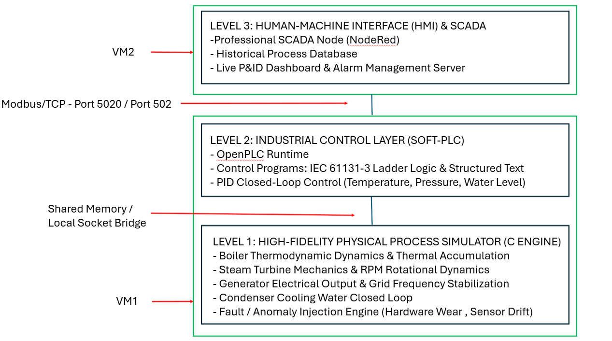
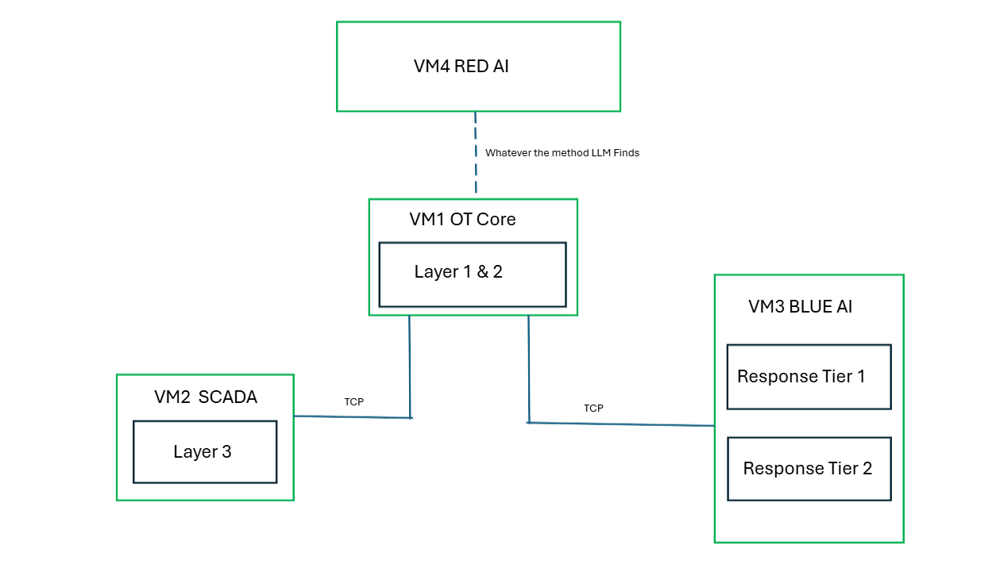

# OT Power Plant Security Testbed with Agentic AI

An Operational Technology (OT) testbed simulating a critical infrastructure power plant using an adapted Purdue 4-Layer Architecture across a 4-Virtual Machine network topology. This environment pairs physical process simulation with real-time industrial protocols (Modbus/TCP) and incorporates a Two-Tiered Agentic AI Security Architecture (Tier 1 Local ML Node & Tier 2 LLM Agent) to evaluate autonomous threat detection, continuous automated penetration testing, and closed-loop incident response in an air-gapped environment.

---

## 1. Physical Process and Network Deployment

The environment is distributed across 4 isolated Virtual Machines on a private, host-only virtual network:

* **VM 1 (Level 1 - Physics Engine):** Executes continuous thermodynamic algorithms in C++/Python simulating thermal accumulation, pressure buildup, mass flow, and emergency valve dynamics.
* **VM 1 to VM 2 Interface:** Communicates locally inside VM 1 via Shared Memory / Local Inter-Process Communication (IPC) to simulate zero-latency physical hardware I/O wiring.
* **VM 1 (Level 2 - PLC Emulation):** Runs an OpenPLC / pyModbusTCP instance holding physical telemetry in Modbus registers:
  * Register 0000: Boiler Temperature (C)
  * Register 0001: Internal Pressure (PSI)
  * Register 0002: Emergency Relief Valve State (0 = Closed, 1 = Open)
* **VM 2 (Level 3 - SCADA HMI):** Hosts operator dashboards (e.g., Node-RED/Ignition), polling VM 1 over Modbus/TCP (Port 502/5020) to render telemetry and control commands.
* **VM 3 (Blue Team - Defensive AI Agent):** Sniffs network frames and hosts the two-tiered defensive security architecture.
* **VM 4 (Red Team - Offensive AI Agent):** Runs automated penetration testing scripts, executing reconnaissance, Modbus packet spoofing, and dynamic exploit injection against VM 1.

---

## 2. Two-Tiered Defensive AI Architecture

Defensive operations inside VM 3 use a hybrid processing structure:

### Tier 1: High-Speed Packet Filter (Statistical ML)
* **Model:** Isolation Forest trained on normal operational baselines.
* **Execution:** Sniffs Modbus packets in real time (via PyShark/Scapy) and parses features (Source IP, Function Code, Packet Length, Time Delta, Register Address) into numerical vectors. Evaluates incoming traffic in under 1 millisecond.
* **Trigger:** Flags sparse outliers or statistical anomalies and pushes the telemetry context payload to Tier 2.

### Tier 2: Agentic LLM Orchestrator (Reasoning & Mitigation)
* **Engine:** LLM reasoning agent (e.g., Gemini API / local Qwen/Llama instance).
* **Capabilities:** Evaluates physical plant status, distinguishes cyberattacks from normal operational load, and uses Function Calling to invoke mitigation tools:
  * Network Isolation: Executes local iptables commands to drop compromise traffic.
  * OT Interlocks: Issues Modbus write overrides or opens physical emergency relief valves.

---

## 3. Human-In-The-Loop Guardrails

* **Automated Defensive Actions:** Low-risk actions (packet logging, IP firewall blocks) execute automatically upon agent reasoning.
* **Operator Approval:** High-risk physical overrides (boiler shutdown, emergency valve trips) prompt for human confirmation on the SCADA console before execution to mitigate hallucination risks.

